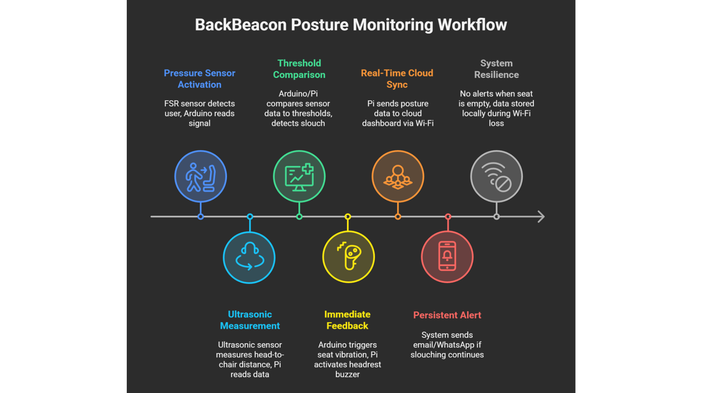

# BackBeacon – Smart Posture Correction System

---

## 1. Project Overview

**BackBeacon** is a smart, attachable embedded system designed to **monitor and correct poor sitting posture in real-time**. It helps users maintain healthy ergonomics during long sitting sessions such as studying, working, or gaming.

Poor posture, particularly slouching, can cause:

* Back pain and spinal misalignment
* Shoulder and neck stiffness
* Fatigue and reduced productivity

Traditional solutions like posture-correcting chairs or wearable sensors are often **expensive, bulky, or uncomfortable**. BackBeacon provides an **affordable, portable, and practical solution** by combining sensor technology, microcontrollers, and IoT communication to deliver instant feedback and real-time posture logging.

---

## 2. Key Objectives

1. **Real-Time Posture Monitoring:** Continuously detect the user’s sitting posture.
2. **Immediate Feedback:** Haptic (vibration) and audible (buzzer) alerts for poor posture.
3. **Data Logging:** Record posture data on a cloud dashboard for tracking progress.
4. **Multiple Modes:** Support various user modes such as Anti-Slouch, Deadline, and Custom.
5. **Wireless Operation:** Arduino Nano 33 IoT communicates with Raspberry Pi 4 wirelessly.
6. **Portable & Battery-Powered:** Compact, attachable design suitable for any chair.

---

## 3. System Architecture

BackBeacon operates through **two modules** and a cloud dashboard:

### 3.1 Seat Module (Arduino Nano 33 IoT)

**Function:** Detects seat occupancy and provides vibration feedback for poor posture.

**Components & Connections:**

| Component               | Pin    | Function                             |
| ----------------------- | ------ | ------------------------------------ |
| FSR-402 Pressure Sensor | A0     | Detects seat occupancy               |
| Vibration Motor         | D9     | Provides haptic feedback             |
| TX/RX                   | D1/D0  | UART communication with Raspberry Pi |
| VCC/GND                 | 5V/GND | Power                                |

**Operation:**

* Monitors pressure sensor to detect if the user is seated.
* Activates vibration motor if slight slouch is detected.
* Sends seat occupancy and alert status to Raspberry Pi.

---

### 3.2 Headrest Module (Raspberry Pi 4)

**Function:** Measures head position and triggers audible alerts for poor posture.

**Components & Connections:**

| Component                 | GPIO Pin                   | Function                               |
| ------------------------- | -------------------------- | -------------------------------------- |
| HC-SR04 Ultrasonic Sensor | TRIG: GPIO17, ECHO: GPIO27 | Measures head distance from chair back |
| Buzzer                    | GPIO22                     | Emits audible alert                    |
| UART RX/TX                | GPIO14/15                  | Receives seat module data              |
| 5V/GND                    | –                          | Power lines                            |

**Operation:**

* Continuously monitors the user’s head distance.
* If distance threshold exceeds (slouching), buzzer sounds.
* Sends posture data to Firebase cloud for dashboard updates.

---

### 3.3 Dashboard (Web Interface)

**Function:** Provides **real-time visualization** of posture status and historical logs.

**Components:** HTML, CSS, JavaScript, Firebase Realtime Database

**Features:**

* Real-time posture status: Good (Green), Slouch (Red), Idle (Gray)
* Historical logs with timestamps for user progress tracking
* Responsive design for desktop and mobile devices

**Folder Structure:**

```
BackBeacon/
│
├── SeatModule/
│   └── seat_module.ino         # Arduino Nano 33 IoT code
│
├── HeadrestModule/
│   └── headrest_module.py      # Raspberry Pi 4 code
│
├── Dashboard/
│   ├── index.html              # Dashboard HTML
│   ├── style.css               # Dashboard CSS
│   ├── script.js               # Dashboard JS
│   └── firebase-config.js      # Firebase credentials/config
│
├── README.md                   # Project explanation
└── WorkFlow.png                # Project workflow diagram
```

---

## 4. Working Principle

1. **System Activation:** Seat module detects user presence via FSR pressure sensor.
2. **Posture Monitoring:** Headrest module measures head distance from chair back.
3. **Analysis & Feedback:**

   * Slight slouch → Vibration motor activates.
   * Continued slouch → Buzzer sounds.
   * Alerts are logged to Firebase dashboard.
4. **Idle State:** When no pressure detected, system resets and waits for next session.

**Alert Flow Diagram:**

```
User sits → Seat sensor detects → Vibration alert → Headrest monitors → Buzzer alert → Dashboard logging
```

---

## 5. Features

* Dual-module design for seat and headrest monitoring
* Pressure-based seat occupancy detection
* Ultrasonic distance sensing for head posture
* Multi-level feedback: Vibration → Buzzer → Dashboard alert
* Customizable modes for different use cases
* Real-time posture logging to cloud dashboard
* Compact, portable, and battery-efficient

---

## 6. Prerequisites

* Arduino IDE for uploading `seat_module.ino`
* Raspberry Pi 4 with Python 3 and GPIO libraries (`RPi.GPIO`)
* Firebase project with Realtime Database
* Internet connection for cloud dashboard updates

---

## 7. Installation & Deployment

### 7.1 Seat Module (Arduino)

1. Connect FSR sensor and vibration motor to Arduino pins as per configuration.
2. Upload `seat_module.ino` using Arduino IDE.

### 7.2 Headrest Module (Raspberry Pi)

1. Connect ultrasonic sensor and buzzer to GPIO pins.
2. Install Python dependencies:

```bash
pip install RPi.GPIO firebase-admin
```

3. Place Firebase credentials JSON in the project folder.
4. Run `headrest_module.py` to start monitoring posture.

### 7.3 Dashboard Deployment

1. Replace `firebase-config.js` with your Firebase project configuration.
2. Deploy the `/Dashboard` folder on **Netlify** or any static web hosting platform.
3. The dashboard updates **in real-time** using Firebase Realtime Database.

---

## 8. Usage

1. Attach the BackBeacon seat module to your chair.
2. Sit on the chair to activate posture monitoring.
3. If slouch is detected:

   * Vibration motor triggers first (Arduino).
   * Buzzer sounds if slouch continues (Raspberry Pi).
   * Dashboard logs event and updates in real-time.
4. Sit upright to stop alerts and resume normal logging.

---

## 9. Workflow Diagram



---

## 10. Future Enhancements

* Multi-user profiles with personalized settings
* Mobile push notifications for alerts
* Analytics and visual graphs for posture trends
* Integration with wearable devices for more advanced feedback

---

